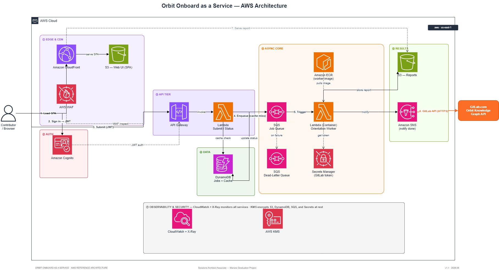

# Orbit Onboard as a Service - AWS Architecture

*This is the enterprise scaling architecture for **Orbit Onboard**, built for the GitLab Transcend Hackathon. [View the main GitLab agent repository here](https://gitlab.com/Ahmad-Faraj/orbit-onboard).*

My Manara AWS Solutions Architect Associate graduation project. orbit-onboard is a Python CLI that generates a new-contributor orientation from the GitLab Orbit Knowledge Graph. This architecture runs it as a multi-user, serverless web service on AWS.



## How it works

A user submits a GitLab project path through a web UI. **API Gateway** (Cognito JWT auth) invokes a **Submit Lambda** that checks a **DynamoDB cache** - cache hit returns the report instantly. Cache miss enqueues a job on **SQS**, which triggers a **container Worker Lambda** (from **ECR**) that reads the GitLab token from **Secrets Manager**, runs the Orbit queries, writes the report to **S3**, and publishes to **SNS**. A **Dead-Letter Queue** captures failures. **CloudWatch + X-Ray** cover observability. **KMS + WAF + IAM** handle security.

## Docs

| # | | |
|---|---|---|
| 1 | [Requirements](./docs/01-requirements.md) | Functional + non-functional, scale anchor, out-of-scope |
| 2 | [Architecture](./docs/02-architecture.md) | Components and request flows |
| 3 | [Design Decisions](./docs/03-design-decisions.md) | Options / Choice / Rationale for 8 key decisions |
| 4 | [Well-Architected](./docs/04-well-architected.md) | Six-pillar mapping |
| 5 | [Risks](./docs/05-risks.md) | Risk register |
| 6 | [Future Work](./docs/06-future-work.md) | v2 improvements |
| 7 | [Appendix](./docs/07-appendix.md) | Service inventory + deployment |

## Layout

```
├── README.md
├── diagram/        architecture.drawio + architecture.png
├── docs/           01–07 reference documents
├── api/            Submit / Status Lambda (zip)
├── worker/         Dockerfile + handler (container, bundles glab)
└── infra/          AWS SAM template
```

> Ahmed Elsayed Abdo Ali Faraj · Manara AWS SAA · based on [orbit-onboard](https://gitlab.com/Ahmad-Faraj/orbit-onboard)
